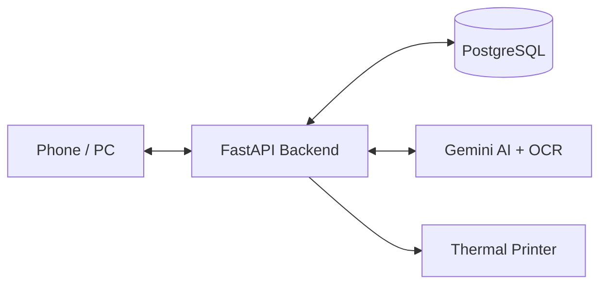

# DawaiFlow

> **Making everyday pharmacy work faster, simpler and smarter.**

DawaiFlow is an AI-powered billing and inventory management platform designed for independent pharmacies in India. It connects medicine identification, purchase intake, inventory, billing, payments, expiry management and pharmacy operations into one connected workflow.

- **Hackathon:** Innovate Without Borders  
- **Category:** Healthcare & MedTech

---

## The Problem

Independent pharmacists handle demanding daily workloads while managing fragmented administrative tasks:

- Manual and repetitive counter billing
- Medicine identification and pack data entry
- Purchase invoice processing and line-item entry
- Batch and expiry date tracking
- Real-time stock updates
- Supplier ledgers and credit records
- Customer Khata (credit) balances and payment tracking
- Sales and purchase returns handling
- GST compliance and invoicing

> Pharmacy operations are naturally connected, but traditional workflows often make pharmacists handle them as separate, repetitive tasks.

---

## The Solution

DawaiFlow unites essential pharmacy operations into a single operational flow:

**Purchase → AI Scanning → Verify → Inventory → Billing → Payment → Reports**

DawaiFlow brings AI scanning, inventory, POS billing, supplier management, customer Khata, expiry tracking, and reporting into one unified platform. Designed for practical retail work, pharmacists remain in full control of reviewing AI-extracted information before any important transaction is committed.

---

## Key Features

- 🤖 **AI Medicine Scanning** — Identify medicines from strips and packaging photos.
- 📄 **AI Invoice/Bill OCR** — Extract line items, batch, expiry, quantity, pricing, and GST from supplier bills.
- 📸 **Multi-Image Invoice Scanning** — Process multi-page supplier invoices in a single intake flow.
- 💊 **Smart POS Billing** — Barcode billing, fast search, FEFO batch allocation, and loose-tablet sales.
- 📦 **Live Inventory** — Automatic stock updates, batch tracking, stock adjustments, and bulk Excel/CSV import.
- ⏳ **Expiry Management** — Isolate expired stock, receive upcoming expiry alerts, and view inventory value-at-risk.
- 🏪 **Supplier Management** — Supplier records, purchase history, credit ledgers, and purchase returns.
- 💰 **Customer Khata** — Manage credit ledgers, partial/full settlements, and send WhatsApp payment reminders.
- 🧾 **GST Billing & PDF Invoices** — Generate professional, GST-compliant tax bills.
- 🖨️ **Thermal Printing** — Print physical receipts with native ESC/POS thermal printer support.
- 📊 **Reports & Analytics** — Track sales, revenue trends, and inventory movement insights.
- 🔐 **Multi-Tenant Security** — JWT authentication, staff roles (RBAC), and shop-level (`shop_id`) data isolation.
- 🔔 **Notifications** — Real-time Firebase push notifications and WhatsApp payment reminders.

---

## How It Works

**1. Capture**  
Medicine, invoice, barcode or pharmacy data is captured through mobile or web.

**2. AI Understands**  
Gemini AI and OCR models extract relevant medicine, batch, price, and invoice information.

**3. Verify**  
The pharmacist checks and confirms the extracted information.

**4. Process**  
DawaiFlow applies inventory, billing, GST, FEFO batch, and payment logic.

**5. Update**  
Inventory, sales, purchases, and ledgers are automatically updated in real-time.

**6. Act**  
Generate a bill, print receipts, settle payments, review expiry alerts, or export data.



---

## Tech Stack

| Layer | Technology |
| :--- | :--- |
| **Backend** | FastAPI (Python 3.11) |
| **Database** | PostgreSQL + SQLAlchemy |
| **Web App** | React (Vite) |
| **Mobile App** | Flutter |
| **AI / OCR** | Gemini 3.1 Flash-Lite + PaddleOCR |
| **Printing** | ESC/POS Thermal Printing |
| **Auth & Security** | JWT & `shop_id` Tenant Scoping |

---

## Quick Setup & Local Running

### Backend
```bash
python -m venv venv
source venv/bin/activate  # On Windows: .\venv\Scripts\activate
pip install -r requirements.txt
cp .env.example .env     # Configure database & API keys
uvicorn app:app --reload --port 8000
```

### Web Dashboard (`public_site`)
```bash
cd public_site
npm install
npm run dev
```

### Mobile App (`flutter`)
```bash
cd flutter
flutter pub get
flutter run
```

---

## Real-World Pilot & Impact

DawaiFlow is being tested through real-world pharmacy workflows to validate medicine identification, purchase OCR, FEFO billing, and Khata tracking under live operational conditions.

### Pilot Results
- **Location / Pilot Site:** [ADD PILOT PHARMACY / LOCATION IF PUBLIC]
- **Bills Processed:** [ADD NUMBER OF BILLS PROCESSED]
- **Medicines / Transactions Tested:** [ADD NUMBER TESTED]
- **Time Saved:** [ADD TIME SAVED, IF MEASURED]
- **Accuracy Rate:** [ADD ACCURACY RESULT, IF MEASURED]

---

## Team & License

### Team
- **Institution:** Bharatiya Vidyapeeth College of Engineering, New Delhi
- **Team Name:** [TEAM NAME]
- **Members:** [MEMBER 1] | [MEMBER 2] | [MEMBER 3] | [MEMBER 4]

### License
[ADD LICENSE HERE]
